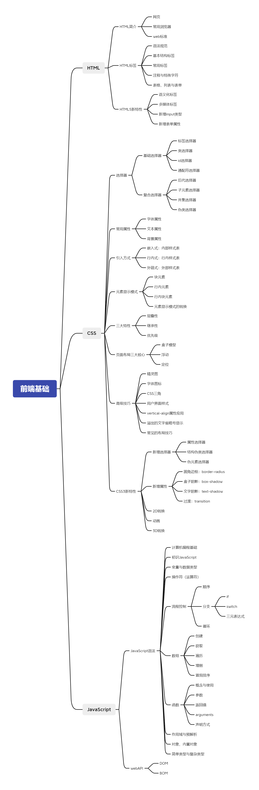

<b>一、入门阶段：学习内容</b>

#### 2.1 学习目标
熟练掌握HTML、CSS和JavaScript语法，能够独立写出动态页面。
#### 2.2 学习材料
* HTML+CSS:

[pink老师前端入门：h5(html5)+css3+移动端](https://www.bilibili.com/video/BV14J4114768?share_source=copy_web&vd_source=df500aa578f7c27948190a812f733388)

* JavaScript:

[pink老师前端进阶：JavaScript基础语法-dom-bom-js-es6新语法-jQuery-数据可视化echarts](https://www.bilibili.com/video/BV1Sy4y1C7ha?share_source=copy_web&vd_source=df500aa578f7c27948190a812f733388)

[配套素材](https://gitee.com/piante/blackHorse-PinkTeacher-PPT/tree/master/)

* JS ES6：

[尚硅谷Web前端ES6教程，涵盖ES6-ES11](https://www.bilibili.com/video/BV1uK411H7on?share_source=copy_web&vd_source=df500aa578f7c27948190a812f733388)

[阮一峰ES6入门教程](https://es6.ruanyifeng.com/)

#### 2.3 思维导图（未完待续...）
